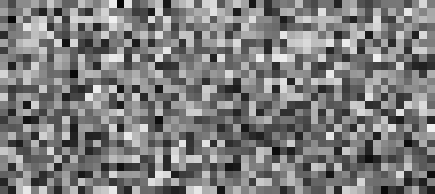

# Learning-to-Cache for DiT

## Requirement
With pytorch(>2.0) installed, execute the following command to install necessary packages
```
pip install accelerate diffusers timm torchvision wandb
```

## Sample Image
For DDIM-20:
```
python sample.py --model DiT-XL/2 --num-sampling-steps 20 --ddim-sample --accelerate-method dynamiclayer --path ckpt/DDIM20_router.pt --thres 0.1
```

For DDIM-50:
```
python sample.py --model DiT-XL/2 --num-sampling-steps 50 --ddim-sample --accelerate-method dynamiclayer --path ckpt/DDIM50_router.pt --thres 0.1
```
The code would repeat the generation for 5 times to avoid the fluctuations in the inference time. If you want to see the images without acceleration, you can use the follwing command:
```
python sample.py --model DiT-XL/2 --num-sampling-steps 20 --ddim-sample 
```

## Sample 50k images for Evaluation
If you want to reproduce the FID results from the paper, you can use the following command to sample 50k images:
```
torchrun --nnodes=1 --nproc_per_node=8 --master_port 12345 sample_ddp.py --model DiT-XL/2 --num-sampling-steps NUM_STEPS --ddim-sample --accelerate-method dynamiclayer --path PATH_TO_TRAINED_ROUTER --thres 0.1
```
Be sure to modify NUM_STEPS and PATH_TO_TRAINED_ROUTER to correspond to the respective NFE steps and the location of the router.

## Calculate FID
We follow DiT to evaluate FID by [the code](https://github.com/openai/guided-diffusion/tree/main/evaluations). Please install the required packages, download the pre-computed sample batches, and then run the following command:
```
python evaluator.py ~/ckpt/VIRTUAL_imagenet256_labeled.npz PATH_TO_NPZ
```

Results:

| NFE | Router | IS | sFID | FID | Precision | Recall |  Latency | 
| -- | -- | -- | -- | -- |  -- | -- | -- | 
| 50 | - | 238.64 | 2.264 |	4.290 |	80.16 |	59.89 |  7.245±0.029 | 
| 50 | ckpt/DDIM50_router.pt | 244.14 | 2.269| 4.226| 80.91| 58.80 |  5.568±0.017 | 
| 20 | - | 223.49 | 3.484 |	4.892 | 78.76 | 57.07 | 2.869±0.008 |
| 20 | ckpt/DDIM20_router.pt | 227.04 | 3.455| 4.644| 79.16| 55.58 |  2.261±0.005 |


## Training
Here is the command for training the router. Make sure you change the PATH_TO_IMAGENET_TRAIN to your path for the training set of ImageNet. 
```
torchrun --nnodes=1 --nproc_per_node=8 --master_port 12345 train_router.py --model DiT-XL/2 --data-path PATH_TO_IMAGENET_TRAIN --global-batch-size 64 --image-size 256 --ckpt-every 1000 --l1 5e-6 --lr 0.001 --wandb
```
The checkpoint for the router would be saved in `results/XXX-DiT-XL-2/checkpoints`. You can also observe the changes in the router during the learning process on wandb.

<div align="center">
  </img>
  <br>
  <em>
      (Changes in the router during training) 
  </em>
</div>

* Hyperoarameters for training the routers:

| Model | DiT-XL/2 | DiT-XL/2 | DiT-XL/2 | DiT-XL/2 |  DiT-L/2 |  DiT-L/2 | 
| -- | -- | -- | -- | -- |  -- | -- |
| NFE   | 50         | 20       | 10        | 50        | 50       | 20   |
| Resolution | 256 | 256 | 256 | 512 | 256 | 256 |
| - For Train | | | | | | 
| \lambda (--l1) | 1e-6 | 5e-6 | 1e-6 | 5e-6 | 1e-6 | 5e-6 |
| learning rate (--lr) |  1e-3 | 1e-3 | 1e-3 | 1e-3 | 1e-3 | 1e-2 |
| - For Inference | | | | | | 
| \theta (--thres) | 0.1 | 0.1 | 0.1 | 0.9 | 0.1 | 0.1 | 0.1 |


## Acknowledgement
This implementation is based on [DiT](https://github.com/facebookresearch/DiT). 

