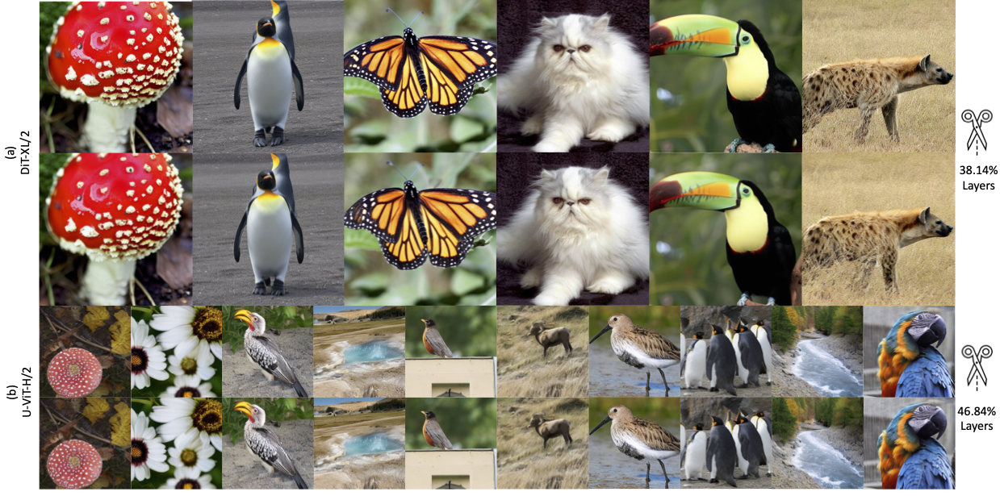
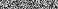
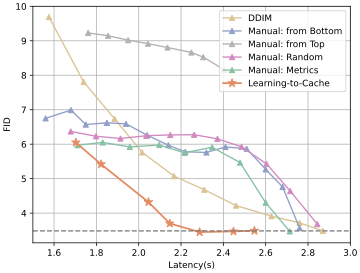
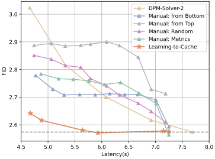

# Learning-to-Cache: Accelerating Diffusion Transformer via Layer Caching
<div align="center">
  </img>
  <br>
  <em>
      (Results on DiT-XL/2 and U-ViT-H/2) 
  </em>
</div>
<br>

> **Learning-to-Cache: Accelerating Diffusion Transformer via Layer Caching**   🥯[[Arxiv]](https://arxiv.org/abs/2406.01733)    
> [Xinyin Ma](https://horseee.github.io/), [Gongfan Fang](https://fangggf.github.io/), [Michael Bi Mi](), [Xinchao Wang](https://sites.google.com/site/sitexinchaowang/)   
> [Learning and Vision Lab](http://lv-nus.org/), National University of Singapore, Huawei Technologies Ltd  


## Introduction
We introduce a novel scheme, named **L**earning-to-**C**ache (L2C), that learns to conduct caching in a dynamic manner for diffusion transformers. A router is optimized to decide the layers to be cached. 

<div align="center">
  </img>
  <br>
  <em>
      (Changes in the router for U-ViT when optimizing across different layers (x-axis) over all steps (y-axis). The white indicates the layer is activated, while the black indicates it is disabled.) 
  </em>
</div>


**Some takeaways**:

1. A large proportion of layers in the diffusion transformer can be removed, without updating the model parameters.
   - In U-ViT-H/2, up to 93.68% of the layers in the cache steps (46.84% for all steps) can be removed, with less than 0.01 drop in FID. 

2. L2C largely outperforms samplers such as DDIM and DPM-Solver. 

<div align="center">
  </img>
  </img>
  <br>
  <em>
      (Comparison with Baselines. Left: DiT-XL/2. Right: U-ViT-H/2)
  </em>
</div>

## Checkpoint for Routers
| Model | NFE | Checkpoint |
| -- | -- | -- |
| DiT-XL/2 |  50 | [link](DiT/ckpt/DDIM50_router.pt) |
| DiT-XL/2 |  20 | [link](DiT/ckpt/DDIM20_router.pt) |
| U-ViT-H/2 |  50 | [link](U-ViT/ckpt/dpm50_router.pth) |
| U-ViT-H/2 |  20 | [link](U-ViT/ckpt/dpm20_router.pth)|

## Code
We implement Learning-to-Cache on two basic structures: DiT and U-ViT. Check the instructions below:

1. DiT: [README](https://github.com/horseee/learning-to-cache/tree/main/DiT#learning-to-cache-for-dit)
2. U-ViT: [README](https://github.com/horseee/learning-to-cache/blob/main/U-ViT/readme.md)

## Citation
```
@misc{ma2024learningtocache,
      title={Learning-to-Cache: Accelerating Diffusion Transformer via Layer Caching}, 
      author={Xinyin Ma and Gongfan Fang and Michael Bi Mi and Xinchao Wang},
      year={2024},
      eprint={2406.01733},
      archivePrefix={arXiv},
      primaryClass={cs.LG}
}
```
